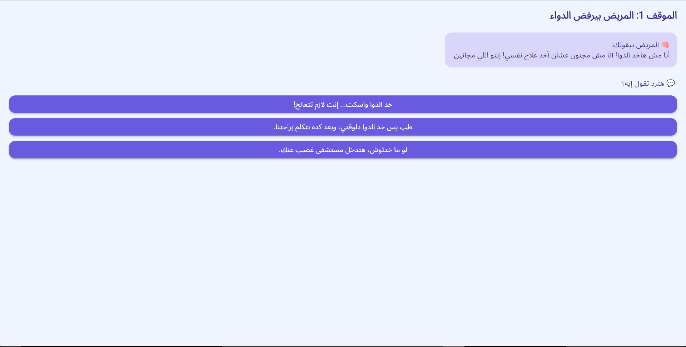
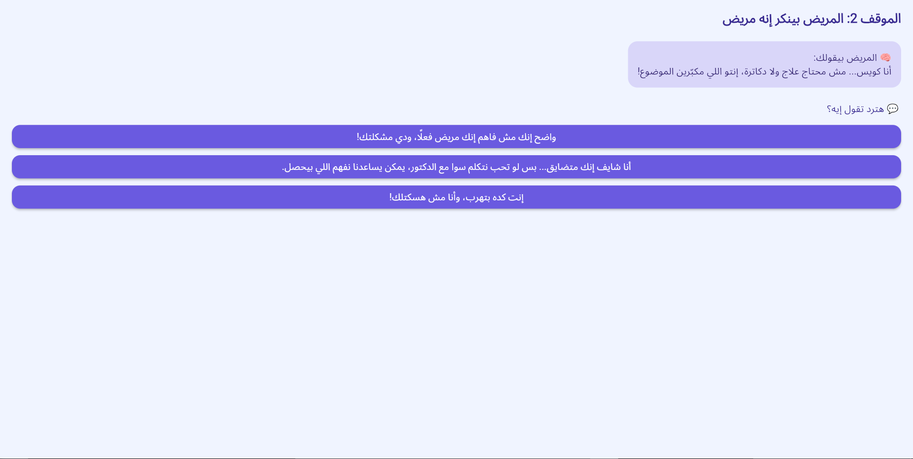
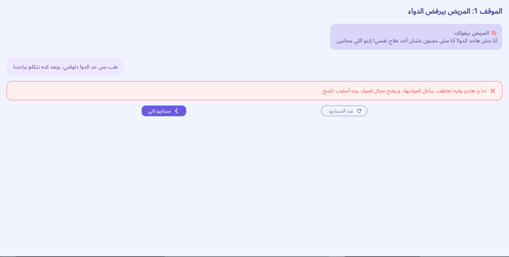
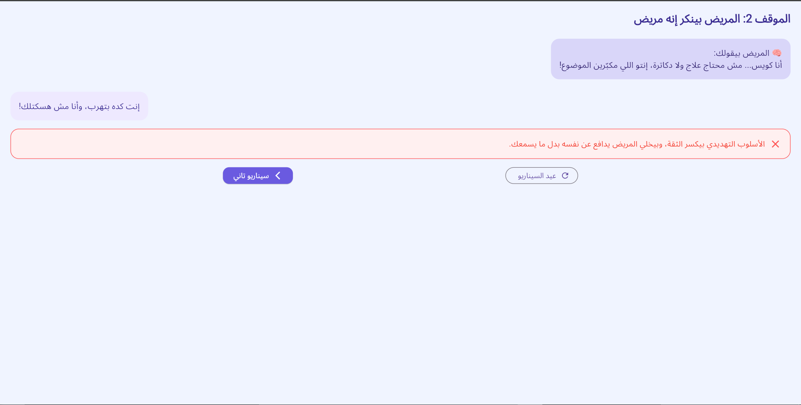

# 🤖 بوت التعامل مع الاضطراب الوجداني ثنائي القطب

تطبيق **Flutter Web** تعليمي تفاعلي، بيحاكي مواقف حقيقية بتقابل أهالي مرضى الاضطراب الوجداني ثنائي القطب، وبيعرض ردود مختلفة مع تقييم فوري لكل رد.  
الهدف من التطبيق هو نشر الوعي، وتقديم تدريب عملي يساعد على تحسين أسلوب التواصل مع المرضى.

---

## 📸 صور من التطبيق

| شاشة الترحيب | شاشة الحوار (1) | شاشة الحوار (2) |
|--------------|-----------------|-----------------|
|  |  |  |

| شاشة النتيجة (1) | شاشة النتيجة (2) |
|------------------|------------------|
|  |  |

---

## ✨ المميزات

- 🎯 **مواقف تفاعلية حقيقية** مبنية على سيناريوهات مدروسة.
- 💬 **اختيارات متعددة** لكل موقف مع تقييم فوري للرد.
- 📚 **محتوى تعليمي** مدعوم بنصائح نفسية للتعامل السليم.
- 🎨 **تصميم جذاب وبسيط** يدعم اللغة العربية واتجاه النص من اليمين لليسار.
- 🌐 **يدعم الويب بالكامل** بفضل Flutter Web.

---

## 🛠️ التقنيات المستخدمة

- **[Flutter](https://flutter.dev/)** – إطار العمل الرئيسي.
- **Dart** – لغة البرمجة.
- **Material Design** – لتصميم الواجهة.
- **Responsive UI** – ليتوافق مع الشاشات المختلفة.
- **RTL Support** – دعم كامل للغة العربية.

---

## 🚀 طريقة التشغيل

### 1. نسخ المشروع
```bash
git clone https://github.com/username/bipolar-chatbot.git
cd bipolar-chatbot
````

### 2. تثبيت الحزم

```bash
flutter pub get
```

### 3. التشغيل على الويب

```bash
flutter run -d chrome
```

> 💡 يمكنك أيضًا بناء نسخة جاهزة للنشر:

```bash
flutter build web
```

---

## 📂 هيكل المشروع

```
lib/
│
├── main.dart              # نقطة تشغيل التطبيق
├── welcome_page.dart      # شاشة الترحيب
├── chat_bot_screen.dart   # شاشة الحوار التفاعلي
└── model/
    └── scenario.dart      # تعريف السيناريوهات والمواقف
```

---

## 🧩 كيفية العمل

1. يبدأ المستخدم من **شاشة الترحيب** مع مقدمة عن فكرة التطبيق.
2. ينتقل إلى **شاشة الحوار** حيث يظهر موقف حقيقي.
3. يختار المستخدم أحد الردود المتاحة.
4. يحصل على **تقييم فوري** لردّه مع نصائح للتعامل الأفضل.
5. يمكنه إعادة نفس السيناريو أو الانتقال لسيناريو آخر.

---

## 📜 الترخيص

هذا المشروع مفتوح المصدر ويمكن تعديله وتطويره بحرية.

---

## ✍️ المساهمة

إذا كان لديك سيناريوهات جديدة أو تحسينات للتطبيق، لا تتردد في فتح **Pull Request** أو **Issue** في المستودع.
